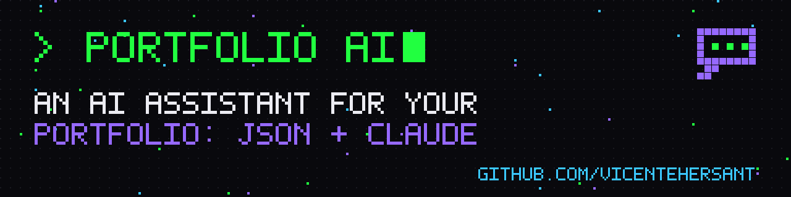
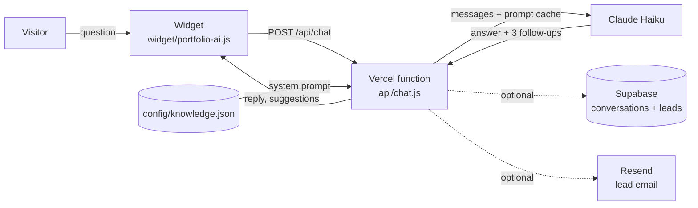

# Portfolio AI

**An AI assistant for your personal portfolio.** It answers recruiters' questions about you (experience, projects, skills, availability) from a single JSON file, in any language, and never makes things up.

Extracted from the live assistant on **[vicentehernaiz.tech](https://vicentehernaiz.tech)**. Try it there.

- One serverless function (`api/chat.js`) on Vercel + Claude Haiku
- One JSON knowledge base you control (`config/knowledge.json`)
- Drop-in vanilla JS chat widget, themable with CSS variables
- Optional extras: Supabase logging, lead capture, email alerts via Resend, token-cost tracking
- Works with **only** `ANTHROPIC_API_KEY`

## How it works



1. The widget sends the question plus the last 3 exchanges.
2. `api/chat.js` builds a system prompt from your JSON with strict grounding rules: answer only from the data, use your fallback when unsure, reply in the visitor's language.
3. Claude replies with a short answer and 3 suggested follow-up questions (rendered as chips).
4. If you configured Supabase or Resend, the assistant can offer, once, to pass the visitor's contact details on to you (tool use, `save_lead`).

## Install in 5 steps

1. **Use this template** on GitHub (or clone it).
2. **Fill your knowledge base**: copy `config/knowledge.example.json` to `config/knowledge.json` and replace Alex Rivera with you. Field guide: [docs/knowledge-schema.md](docs/knowledge-schema.md). A real, detailed example: [examples/vicente.json](examples/vicente.json).
3. **Set `ANTHROPIC_API_KEY`** in Vercel → Project → Settings → Environment Variables (key from [console.anthropic.com](https://console.anthropic.com)). Everything else in `.env.example` is optional.
4. **Deploy** (import the repo in Vercel, or `npx vercel --prod`). Test it:
   ```bash
   curl -X POST https://YOUR-APP.vercel.app/api/chat \
     -H "Content-Type: application/json" -d '{"message":"What do you do?"}'
   ```
5. **Embed the widget** in your portfolio, before `</body>`:
   ```html
   <link rel="stylesheet" href="https://YOUR-APP.vercel.app/widget/portfolio-ai.css">
   <script src="https://YOUR-APP.vercel.app/widget/portfolio-ai.js" defer
     data-endpoint="https://YOUR-APP.vercel.app/api/chat" data-contact-url="/contact"></script>
   ```
   Options: `data-title`, `data-subtitle`, `data-launcher`, `data-greeting`, `data-chips="Q1|Q2|Q3"`, `data-theme="auto"`. Any element with `data-pai-open` opens the chat; `window.PortfolioAI.ask("...")` works too. Theme it by overriding the `--pai-*` variables in `widget/portfolio-ai.css`.

## Optional integrations

| Feature | Env vars | Notes |
|---|---|---|
| Conversation logging + cost tracking | `SUPABASE_URL`, `SUPABASE_SERVICE_ROLE_KEY` | Run `supabase/schema.sql` first. Logs tokens and estimated USD per turn. |
| Lead capture | Supabase and/or Resend configured | Turn off with `LEAD_CAPTURE=off`. |
| Lead email | `RESEND_API_KEY`, `LEAD_NOTIFICATION_EMAIL`, `LEAD_FROM_EMAIL` | All three required. Sender must be on a domain verified in Resend. |
| Usage stats | `ADMIN_DASHBOARD_KEY` | `GET /api/usage-stats` with header `x-admin-key`. Returns 404 without it. |
| Keep Supabase free tier awake | `CRON_SECRET` (optional) | Daily Vercel cron hits `/api/keepalive`. |
| Model / file / limits | `CHAT_MODEL`, `KNOWLEDGE_FILE`, `RATE_LIMIT_MAX` | Defaults: `claude-haiku-4-5`, `config/knowledge.json`, 20 req/IP/hour. |

## Cost per conversation (Claude Haiku 4.5: $1 / M input tokens, $5 / M output)

| Knowledge base | Prompt size | Per answer | 5-question conversation |
|---|---|---|---|
| Small (the Alex example, ~5 KB) | ~2k tokens | ~$0.004 | **~$0.02** |
| Large (Vicente's file, ~68 KB) | ~16k tokens | ~$0.017 uncached | **~$0.09**, about **$0.03** with prompt caching |

The static part of the prompt is sent with `cache_control`, so follow-up questions within 5 minutes read it at 10% of the input price (Haiku needs a prompt of at least ~4k tokens for caching to apply). 1,000 conversations a month costs roughly $20 to $90. Set a monthly spend limit in the Anthropic console anyway.

## Privacy notes

- **Your knowledge file is public in practice.** Anything in it can be quoted to any visitor, and files outside `api/` are served statically by Vercel. Never put phone numbers, private emails, addresses, client pricing or NDA material in it.
- **Secrets live only in environment variables.** The service role key is used server-side in `lib/supabase.js` and never reaches the widget.
- **Logging is off by default.** If you enable Supabase, visitor questions are stored; RLS is enabled with no policies, so only the server can read them. Say so in your privacy policy and consider the retention query at the end of `supabase/schema.sql`.
- **Lead capture is opt-in for the visitor**: the assistant asks once, and only saves details the visitor typed in themselves.
- No cookies, no IP storage. The IP is used in memory for rate limiting only.

## Project structure

```
api/chat.js            chat endpoint (required)
api/usage-stats.js     cost summary (optional)
api/keepalive.js       Supabase keepalive cron (optional)
lib/                   pricing table + tiny Supabase REST helper
config/                knowledge.json (yours) + knowledge.example.json
examples/vicente.json  real knowledge base, contact details removed
widget/                drop-in chat widget + embed snippet
supabase/schema.sql    optional tables
docs/knowledge-schema.md
```

## Credits

Built by **Vicente Hernaiz** · [vicentehernaiz.tech](https://vicentehernaiz.tech) · [LinkedIn](https://www.linkedin.com/in/vicente-hernaiz-ux)

MIT License. See [LICENSE](LICENSE).
